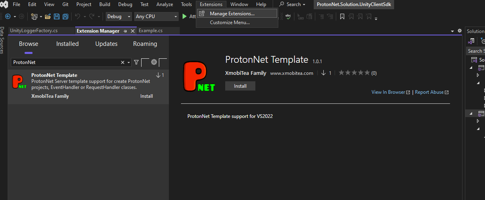
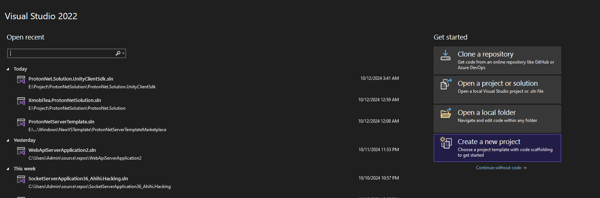
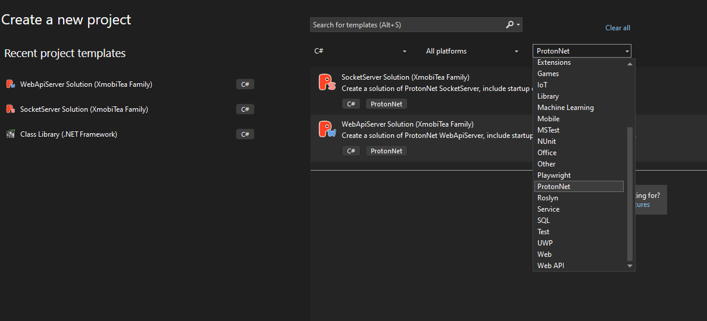
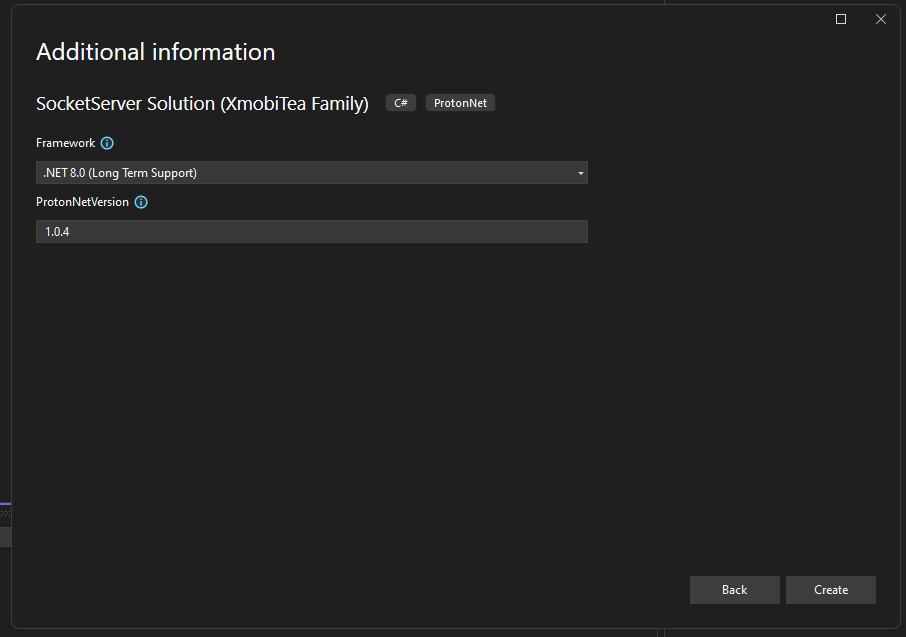
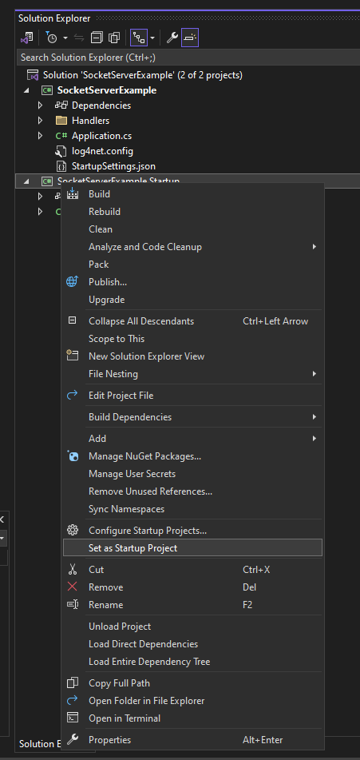
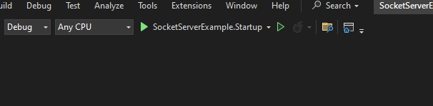
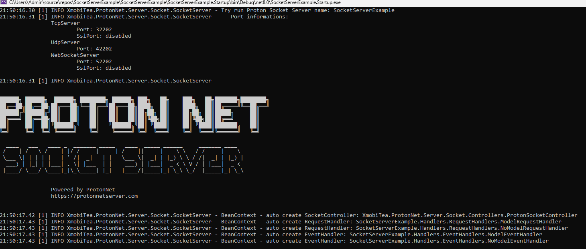

# [Proton Net Server](https://github.com/XmobiTea-Family/ProtonNet.Solution)

# ProtonNet Template for Visual Studio Code

Welcome to the **ProtonNet** template for Visual Studio Code!  
This tool is designed to streamline and enhance the development process for projects within the [ProtonNet Server](https://protonnetserver.com) ecosystem.

## I. Installation

You can install the ProtonNet Template for Visual Studio Code in two ways:

### 1. Install via Marketplace Extensions
  1. Open `Extension/Manage Extensions`.
  2. In the *Browse* section, type `ProtonNet`, then hit Enter.
  3. Press `Install`.

*Note*: You might need to restart Visual Studio Code to complete the installation process.

---

### 2. Install from VSIX
  1. Download the latest release from [ProtonNet Template for Visual Studio](https://github.com/XmobiTea-Family/ProtonNet.Solution.VisualStudioTemplate/releases).
  2. Run the downloaded `.vsix` file (e.g., `protonnetvs-1.0.1.vsix`) to install the extension.

---

## II. How to Use

1. Open Visual Studio Code and create a new project.
2. Choose `ProtonNet` under `Project Type`, as shown below:

3. Select the project type you want to create. In this example, we'll use the project name `SocketServerExample` to create a **SocketServer** solution. You can name the project as you prefer and click `Next`. In this example, we'll use `.NET 8.0` and **ProtonNetVersion 1.0.4**.

4. After the project is created, right-click the `SocketServerExample.Startup` and choose `Set as Startup Project`.

5. Press `F5` or run `SocketServerExample.Startup` to start debugging.

6. You should see a successful run, like this:

---

### How to Create a RequestHandler

1. Navigate to the `RequestHandlers` folder in your project.
2. Add a new item and implement your logic in the `Handle()` method.

Now you're ready to process requests with your custom handler!

---

## III. Release Notes

### Version 1.0.2

- **ProtonNet Tool Support**:
  - Create **SocketServer** projects within the [ProtonNet Server](https://protonnetserver.com) ecosystem.
  - Create **WebApiServer** projects within the [ProtonNet Server](https://protonnetserver.com) ecosystem.

- **File Generators**:
  - Easily generate **WebApiController** files.
  - Generate **EventHandler** files to handle application events.
  - Generate **RequestHandler** files for managing and processing requests.
  - Generate **WebApiHtml** files to build web API interfaces.

## IV. Support

For support or to share your feedback, feel free to join the discussion on [ProtonNet Discussions](https://discussions.protonnetserver.com) or contact me at changx.develop@gmail.com.

**Enjoy your development with ProtonNet!**
