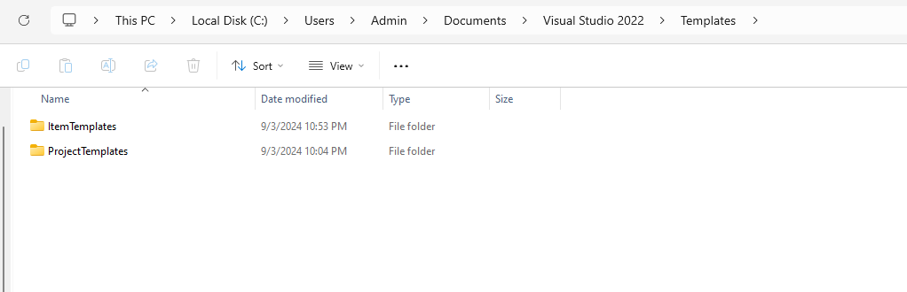
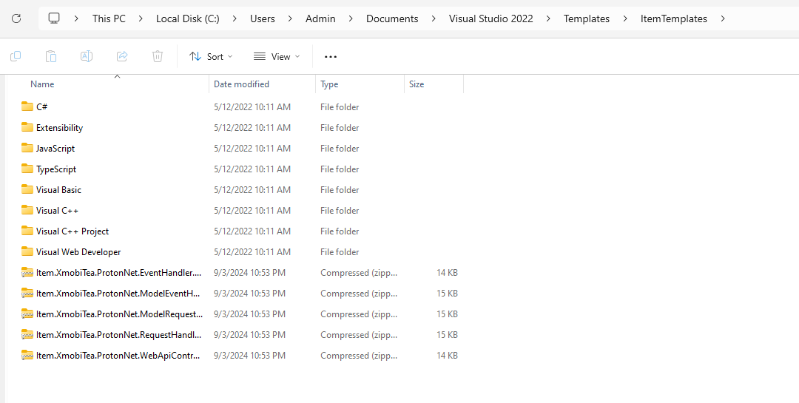
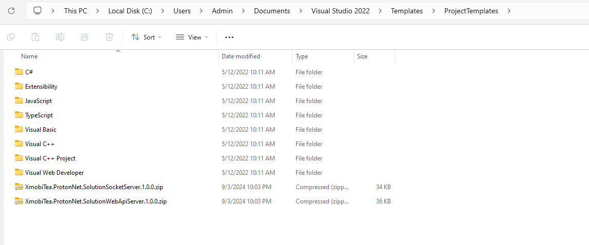
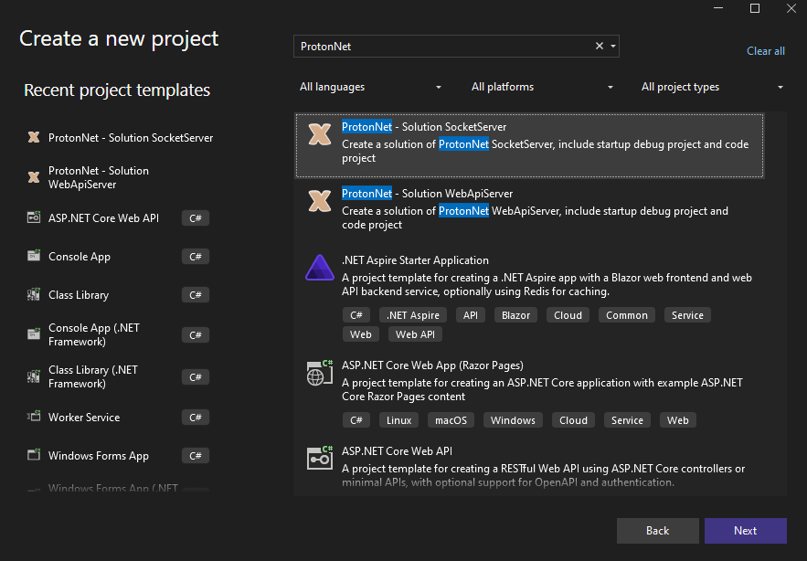
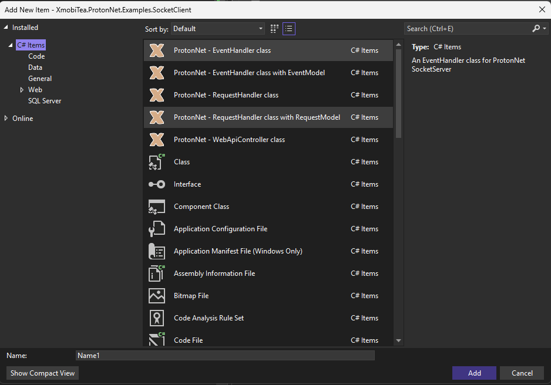

# [Proton Net Server](https://github.com/XmobiTea-Family/ProtonNet.Solution)

# Proton Net Visual Studio Template

## Introduction
This repository helps you quickly set up:
- Proton Net Server projects.
- Proton Net handler classes.

## How to Setup
1. Download the latest release from the [Proton Net Visual Studio Template Releases](https://github.com/XmobiTea-Family/ProtonNet.Solution.VisualStudioTemplate/releases).
2. Extract the release, and you will find the following:

    ### I. ItemTemplates:
        - `Item.XmobiTea.ProtonNet.EventHandler.[VERSION].zip`
        - `Item.XmobiTea.ProtonNet.ModelEventHandler.[VERSION].zip`
        - `Item.XmobiTea.ProtonNet.ModelRequestHandler.[VERSION].zip`
        - `Item.XmobiTea.ProtonNet.RequestHandler.[VERSION].zip`
        - `Item.XmobiTea.ProtonNet.WebApiController.[VERSION].zip`

    ### II. ProjectTemplates:
        - `XmobiTea.ProtonNet.SolutionSocketServer.[VERSION].zip`
        - `XmobiTea.ProtonNet.SolutionWebApiServer.[VERSION].zip`

3. Copy the templates to the appropriate Visual Studio template folders:

   

    #### a. For Windows:
        1. **Item Templates:**
            - Navigate to `C:\Users\[YOUR USER]\Documents\Visual Studio [VERSION]\Templates\ItemTemplates`
            - If there are older versions of these templates, remove them.
            - Copy the Item Templates from section I into this folder.

        2. **Project Templates:**
            - Navigate to `C:\Users\[YOUR USER]\Documents\Visual Studio [VERSION]\Templates\ProjectTemplates`
            - If there are older versions of these templates, remove them.
            - Copy the Project Templates from section II into this folder.

    #### b. For macOS:
        1. **Item Templates:**
            - Navigate to `~/Documents/Visual Studio [VERSION]/Templates/ItemTemplates/`
            - If there are older versions of these templates, remove them.
            - Copy the Item Templates from section I into this folder.

        2. **Project Templates:**
            - Navigate to `~/Documents/Visual Studio [VERSION]/Templates/ProjectTemplates/`
            - If there are older versions of these templates, remove them.
            - Copy the Project Templates from section II into this folder.

4. After copying, your folder structure should look like this:
   
   

5. Restart Visual Studio.
   - When creating a new project, filter by `Proton Net`. If the templates appear as shown in the image below, the Project Templates have been successfully installed.
   

   - When adding a new class, if the templates appear as shown below, the Item Templates have been successfully installed.
   

## Support
If you run into any issues while setting up this Visual Studio Template, feel free to contact us. We're happy to assist when available. You can reach us at `changx.develop@gmail.com`. Please provide details about the issue and some contact information so we can follow up with you.
